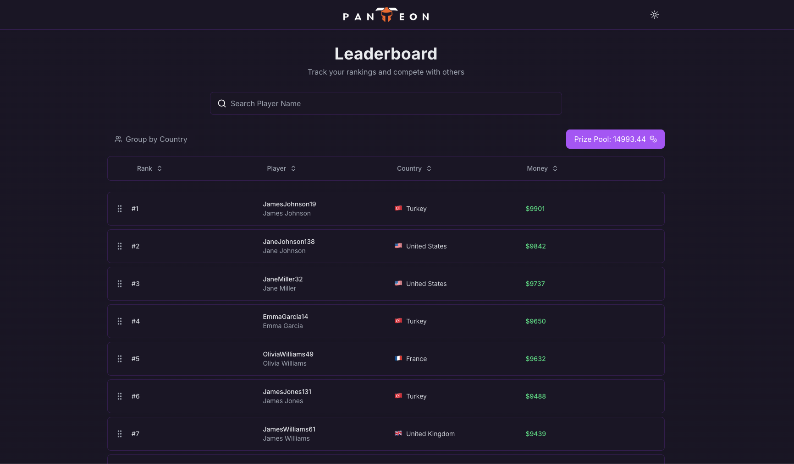
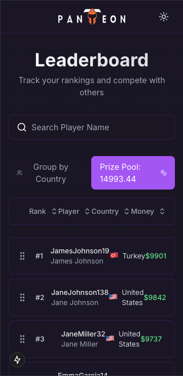
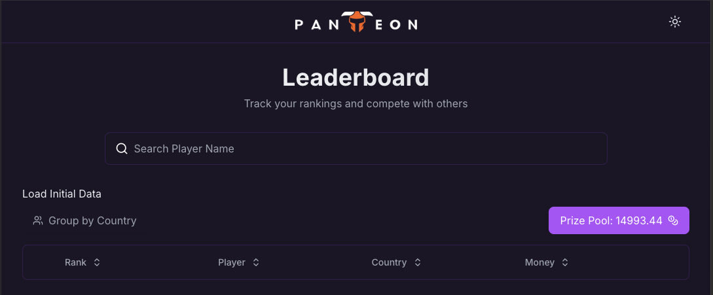

This is Leaderboard Project 

## UI



## Getting Started

First, run the development server:

```bash
npm run dev

```

To load initial data into the application, you can use the "Load Data" button provided in the UI. This will create a set of users and players with random data, and add random amounts of money to each player. This process may take a few minutes to complete. The progress and current step of the data loading process will be displayed on the screen.


## Used Packages


- Axios
- Tailwind CSS
- React Query
- Tanstack Table
- Dnd kit
- jotai 
- lucide-react
- lodash
